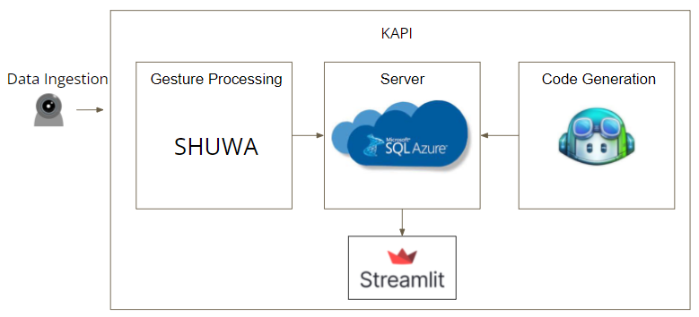

# KAPI

## Inspiration
Welcome to a prototype of our Keyboardless, ASL-inspired Programming Interface (KAPI)! The purpose of KAPI is to translate sign language into Python code, specifically for Machine Learning applications. We aim to remove the need for keyboards and allow users to freely program using only webcam. The process of our prototype can be broken into gesture recognition, data storage, and code generation.

## Architecture

## Gesture Recognition
For this prototype we relied on Google's [Shuwa Gesture Toolkit](https://github.com/google/shuwa) to process
a person's pose, face, and hand gestures and recognize them as commonly used ML functions. As a preliminary
step, we created and included the following gestures into Shuwa's dataset: `load`, `normalize`, `compile`, `evaluate`, and `render`

## Data Storage
After recognizing the gesture, we post the classification to our Azure SQL Database. From there, we map the gesture with a 
table that contains the code translations and post that into this website! This helps as we consider the scalability of our app across many users.

## Code Generation
The table mentioned above was created with the help of [Github Copilot](https://copilot.github.com/). We originally wanted to use 
the full intellisense feature into KAPI, but we could not find a way to call the autocomplete function in Visual Studio (VS) Code without 
pressing `Tab` or `Enter`. Unfortunately without having access to the Copilot code nor having a "hacky" method to call the autocomplete function in VS Code without a 
keyboard, we decided to create our own dataset based on Copilot offline. Alas, this limits the available code translations.

## Room for Improvement
In the future, we'd like the full application to be processed on Azure ML. This would remove the need of opening Shuwa, storing values on a SQL database and displaying it on a website. Users may experience some disconnect since they use separate interfaces, and this should be addressed in the future. For this prototype, we wanted to see how complimentary Shuwa's algorithm would be for our use case, which is real time processing and code generation (and it seems to do well)! Another constrain is the fact that we do not have full utility with Copilot. Either we devise a hacky way to generate autocomplete or continue to expand our manually created dataset. Lastly, we were not able to connect to our SQL server at the last minute, so the demo shows code translations, if the user gestured the commands for load, normalize, compile, evaluate, and render.

## How to run
In your terminal `pip install -r requirements` Then go to the directory `KAPI-website` and run `streamlit run KAPI-website.py` At the bottom you'll see directions on how to 
run Shuwa. To run the gesture recognition, go to the `shuwa-main` directory that contains `webcam_demo_knn.py` and run `python webcam_demo._knn.py`

## [Prototype Demo](https://uci.zoom.us/rec/share/W0VB84wadmxFiK6sebvmxyJahRw-NFg34JbUCHv-aiaVt3xTf6fqU_5eBeyRpv3k.Rrd6bzJwUMKwo4Cj?startTime=1643409309000)
Note that the demo shows code translations, if the user gestured the commands for `load`, `normalize`, `compile`, `evaluate`, and `render`. It is not yet live, since the user's gestures are not connected to the server...yet.
